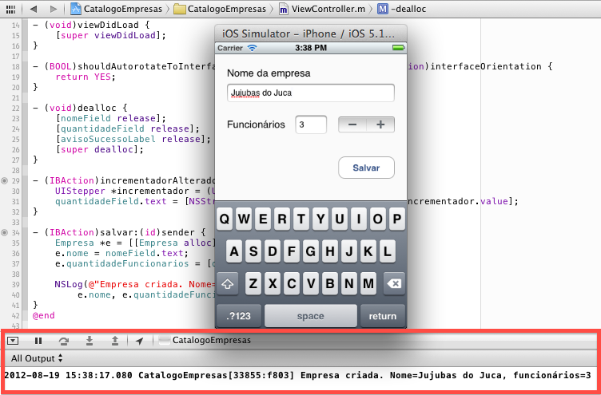
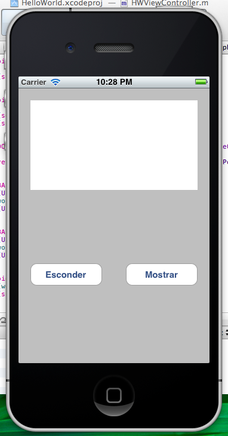

# Como escrever livros com o Tubaina?

Os livros da Casa do Código usam Markdown, uma linguagem de markup muito simples. 

Para aprender um pouco sobre a sintaxe do Markdown, há um guia "oficial" bem razoável:
http://daringfireball.net/projects/markdown/syntax


Existem muitos editores Markdown disponíveis por aí.

Se você quer uma sugestão de editor, sugerimos o Brackets:
http://brackets.io/

Para visualizar a página gerada, instale a extensão Markdown Preview:
https://github.com/gruehle/MarkdownPreview#installation

## Criação de capítulos
Cada capítulo deve ficar em um arquivo `.md` separado.

Ao gerar o livro, os arquivos `.md` serão ordenados por nome e aparecerão no livro nessa ordem.

Recomendamos colocar um número no começo do `.md`. Por exemplo, esse capítulo está no `02-exemplo.md`.

O título do capítulo deve ficar em um `#` logo primeira linha. Nesse capítulo, temos: 

```
    # Como escrever livros com o Tubaina?
```

Evite capítulos que possuam apenas um nome técnico, como o nome de uma classe, de uma função, de um componente. "_Mais e melhores componentes visuais com UIView_" é certamente melhor que "_UIView_". Evite também nomes vagos, como "_Contextualizando_". Dê nomes chamativos e que ilustrem e que mostrem que o leitor irá aprender algo naquele capítulo/seção. Instigue-o. Um exemplo para o lugar de "_Contextualizando_", poderia ser "_Integração de sistemas com transferência de arquivos_".

Como já falamos, um capítulo de apresentação/introdução é importante, mas ele deve ser sucinto, motivador e ilustrado.

> Não use dois pontos (:) no título de seu capítulo. Quando gerarmos o arquivo `.pdf` do livro, ele não aparecerá no sumário, nem o que você escreveu após ele. Opte por usar o travessão (─).

## Divida seu capítulo em seções
As seções podem ser criadas a partir do uso de `##`, contendo o nome da seção a frente. No caso dessa
seção, fica:

```
    ## Criação de seções
      Em seguida vai o conteúdo da seção...
```

Utilize nomes que chamem a atenção do leitor, como verbos no imperativo, por exemplo. O sumário será uma fonte poderosa para a venda da sua obra, e os nomes das seções todos aparecerão por lá.

Uma seção não deve ser muito curta. Esse livro de exemplo não é um bom exemplo em relação a isso :).

> Não use dois pontos (:) no título de sua seção. Quando gerarmos o arquivo `.pdf` do livro, ele não aparecerá no sumário, nem o que você escreveu após ele. Opte por usar o travessão (─).

## Quebras de linha e de página

As quebras de linha devem ser especificadas no arquivo `.md` com duas quebras (ou seja, dois enter). Uma só quebra é desconsiderada, pois admite-se que é apenas para organização do arquivo fonte. Portanto, sempre que quiser um novo parágrafo (como o abaixo), utilize duas quebras de linha.

As quebras de página são feitas automaticamente no build do livro.

## Títulos para chamar atenção dentro de uma seção

Para criar título para um assunto dentro de uma seção, pode-se utilizar `###` contendo o título que será utilizado:

### Títulos subdividem seções longas
Para isso, basta utilizar em algum lugar do seu arquivo .md o seguinte conteúdo:

```
    ### Conclusão e como usar
```

## Definição de boxes
Quando quiser detalhar algo que está no texto, sem perder a linearidade, recomendamos o uso de um Box, no qual é possível adicionar um conteúdo fechado, como a seguir:

> **Linearidade do texto**
>
> Ao apresentarmos uma ideia, devemos manter uma sequência lógica em nosso texto. Mas
> algumas vezes um detalhe técnico avançado merece uma certa atenção. Um box com um texto
> curto pode ajudar a explicar esse ponto mais técnico, sem perder a sequência.
>
> Tome cuidado com boxes muito grandes. É um indicativo que é um conteúdo primordial e não
> apenas uma explicação de um detalhe específico. Nessa situação, use um `###` ou uma
> nova seção.

Criar um box é extremamente simples, bastando que definamos um _quote_ na sintaxe do Markdown. Toda linha de um box deve começar com um `> `.

Caso seu box tenha um título, coloque um texto em negrito na primeira linha. No caso do anterior, tivemos o seguinte:

```
> **Linearidade do texto**
> 
> Ao apresentarmos uma ideia, devemos manter uma sequência
> lógica em nosso texto...
```

Caso você tenha dois box seguidos, o _parser_ do Markdown os transformaria em um só. Por isso, se quisermos dois box, temos que separá-los com um comentário.


```
> **A linha de comando** 
> 
> A maneira mais comum de usar Git é pela
> linha de comando, acessível através de um terminal.

<!-- comentario para separar box adjacentes -->

> **GitHub for Windows** 
> 
> A maioria dos usuários do Windows não tem o hábito de utilizar 
> o prompt de comandos, e perfere instalar alguma aplicação visual 
> para trabalhar com o Git.
```

O resultado do box anterior seria o seguinte:

> **A linha de comando** 
> 
> A maneira mais comum de usar Git é pela
> linha de comando, acessível através de um terminal.

<!-- comentario para separar box adjacentes -->

> **GitHub for Windows** 
> 
> A maioria dos usuários do Windows não tem o hábito de utilizar 
> o prompt de comandos, e perfere instalar alguma aplicação visual 
> para trabalhar com o Git.

Não abuse dos box, nem os faça muito compridos. Se o texto se encaixar à seção de maneira linear, nem se incomode em quebrar em um box. Se precisar de um título, use o `###` para chamar atenção.

## Abuse de imagens explicativas

As imagens são as formas mais convidativas do seu texto. Elas são muito importantes para diminuir a dificuldade de um livro técnico. Podem ser screenshots, esquemas e gráficos. Se você é um dos que  apanha do Photoshop e do Gimp, o Skitch é uma ferramenta simples que vai te auxiliar bastante (www.skitch.com).

Para adicionar imagens, basta utilizar um link do Markdown indicando qual o nome do arquivo que deseja importar. Lembre-se de que
o caminho do arquivo da imagem deverá ser relativo ao diretório onde se encontra o arquivo `.md`.

Nossos exemplares impressos são em preto e branco, então é importante considerar isto na hora de organizar gráficos por cores. Opte por utilizar gradientes que fiquem compreensíveis em cinza, ou dar texturas (preenchimento) diferentes, criando uma legenda. O arquivo em PDF será colorido, mas também é importante considerar que alguns e-readers lerão o EPUB e o MOBI em preto e branco de todo modo.

Também é possível dizer quanto da largura da página será ocupado pela imagem através de uma porcentagem. 100% significa que
a imagem terá a largura de toda a parte onde cabe texto na página (exceto as margens laterais). Cuidado, pois em e-books essa
propriedade não surtirá efeito, pois, como a tela é menor, a imagem ocupará sempre seu tamanho original. Caso estoure, terá
a largura máxima permitida pelo device. Um exemplo de uso é:

```
    
```

É recomendado adicionar legenda nas fotos. Para isso, basta adicionar um texto, sem quebrar linha:

```

```

**É importantíssimo lembrar** que não se deve utilizar imagens com fundo transparente, pois alguns leitores de
e-book não lidam bem com elas. Por isso, **utilize sempre um fundo para as imagens, preferencialmente branco**. Prefira PNGs.

Além disso, evite screenshots da tela inteira: a fonte provavelmente ficará pequena demais para que seja lido no impresso. Para testar se a imagem está legível, compare a fonte do que você quer mostrar com a fonte da legenda que aparece abaixo dela. Caso a fonte da imagem seja menor, será difícil de ler no livro. A figura  representa esse caso.



Um último conselho. Certifique-se de que a borda da imagem não está recortada de maneira a aparecer pequenos "filetes" de outras janelas. O aspecto impresso (e mesmo neste PDF) é bem ruim, como na figura .



Para resolver isso, recorte sua imagem onde for focar. Caso queira usar a tela cheia, diminua a resolução da sua própria tela e aumente as fontes antes do screenshot. No Mac você pode usar o `Command+4`, depois espaço, depois selecionar a janela que quer que seja capturada.

### Inserindo imagens em arquivos de subpastas

É possível adicionar imagens também em subpastas como `intro`, onde ficarão os textos de prefácio e demais introduções.
Para isso, a imagem deve ir **na mesma pasta** `imagens`, junto com as outras, porém, para indicar seu caminho, deve-se acrescentar `../`

```

```

## Criação de lembretes
Se você precisar criar lembretes de algo que você precisa fazer depois, utilize comentários html:
```
    <!-- Algo que eu tenho que me lembrar de reler depois -->
```

Os comentários html não saem na impressão. Você só irá vê-los dentro do arquivo original.

## Divida seu livro em partes

Você pode agrupar alguns capítulos em partes, cada qual com um tema específico. Para isso, cada parte deverá ser uma pasta dentro do repositório do livro (assim como existem as pastas `intro` e `imagens`). As pastas das partes deverão ser nomeadas no seguinte formato:
`part-1`, `part-2` (isto é, "part", hífen, número da parte).

Dentro desta pasta `part-1`, vão os arquivos em `.md` dos capítulos desta parte, sendo que o primeiro arquivo em ordem numérico/alfabética será a **capa da parte**. Por exemplo, a lista de arquivos da pasta `part-1` seria algo como:

* **part-1**:

    * 00-capa-da-parte.md
    * 01-primeiro-capitulo.md
    * 02-segundo-capitulo.md


* **part-2**:
    * 00-capa-da-parte2.md
    * 03-terceiro-capitulo.md
    * 04-quarto-capitulo.md
    
No arquivo `00-capa-da-parte.md`, o título do capítulo (#) é o nome da parte. Você pode escrever um texto introdutório sobre os capítulos que veremos nesta parte. É possível acrescentar imagens.

Vale lembrar que para inserir imagens dentro de subpastas (como a pasta `intro`, `part-1`, `part-2` etc.), é necessário passar o caminho dela seguindo a árvore (utilizando o `../` para indicar o lugar onde fica a pasta `imagens`:

```

```